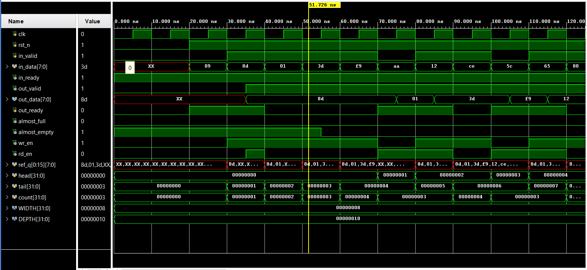

# Verilog FIFO (Ready/Valid Interface)

This repository contains a **parameterized synchronous FIFO** implemented in Verilog along with a self-checking testbench.

##  Features
- Ready/Valid handshake
- Parameterized data width , depth , AFULL threshold and AEMPTY threshold
- Full and empty detection
- Synthesizable RTL
- Self-checking testbench

## Directory Structure
rtl/ - FIFO RTL design
tb/ - Testbench
sim/ - Simulation waveforms

## Design Overview
- FIFO uses **head/tail pointers**
- Count-based full/empty detection
- Supports simultaneous read & write
- Single-clock design

##  Self-Checking Testbench

This project includes a **self-checking (self-testing) testbench** that automatically verifies the correctness of the FIFO without manual waveform inspection.

###  What is a Self-Checking Testbench?
A self-checking testbench:
- Generates input stimulus automatically
- Predicts the expected output using a reference model
- Compares the DUT output with the expected result
- Reports **PASS / FAIL** without user intervention

This ensures reliable and repeatable verification.

---

###  How the FIFO Testbench is Self-Checking

####  Reference Model
The testbench implements a **software-style FIFO model** using:
- An array (`ref_q`)
- Head and tail pointers
- A reference counter

## Simulation
Tested using **Xilinx Vivado Simulator**.

Waveform snapshot:

## Files
- `rtl/fifo.v` – FIFO RTL
- `tb/tb_fifo.v` – Self-checking testbench

## Target Use Cases
- UART buffering
- SPI / I²C data queues
- Packet-based communication
- DSP processing pipelines
- DMA buffering

## Future Integrations

This FIFO is designed as a reusable building block and can be easily extended or integrated into larger digital systems.

###  AXI-Stream Interface Integration
- Replace `in_valid / in_ready` and `out_valid / out_ready` with AXI-Stream signals:
  - `TVALID`, `TREADY`, `TDATA`
- Enables direct connection to:
  - DMA engines
  - AXI interconnects
  - FPGA vendor IP cores

---

###  Asynchronous FIFO (Clock Domain Crossing)
- Extend the design to support:
  - Independent write and read clocks (`wr_clk`, `rd_clk`)
- Add:
  - Gray-code pointers
  - Multi-flop synchronizers
- Useful for:
  - CDC between peripherals
  - High-speed interfaces

---

## Author
David Choudhary
