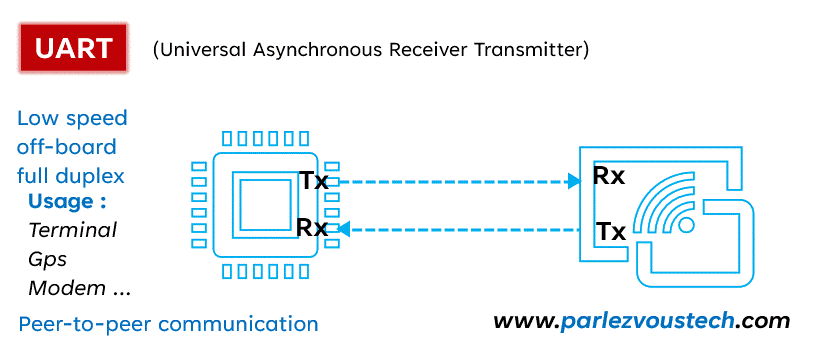

# UART in Verilog

This project implements a Universal Asynchronous Receiver/Transmitter (UART) in Verilog, including:
- Baud rate generator
- Transmitter (TX)
- Receiver (RX)
- Top-level integration
- Testbench for simulation

## Features
- Configurable baud rates (2400, 4800, 9600, 19200, etc.)
- TX and RX modules with start/stop bit handling
- Baud generator designed for a 50 MHz system clock
- Testbench with tasks to send bytes and verify communication

## Project Structure
- `baud_gen.v` : Baud rate generator
- `uart_tx.v`  : Transmitter module
- `uart_rx.v`  : Receiver module
- `uart_top.v` : Top-level integration
- `tb_uart_top.v` : Testbench

## Simulation
The testbench demonstrates sending and receiving bytes:
- Example bytes: `0xA5`, `0xC3`, `0xD5`
- RX correctly decodes data when aligned to `baud_clk`

## How to Run
1. Clone the repository:
   ```bash
   git clone https://github.com/davidchoudhary527-RTL/Prsonal-projexts/UART-Verilog.git
   cd UART-Verilog
